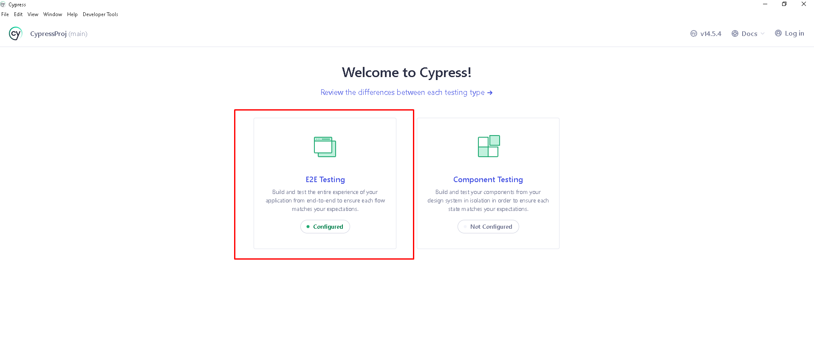
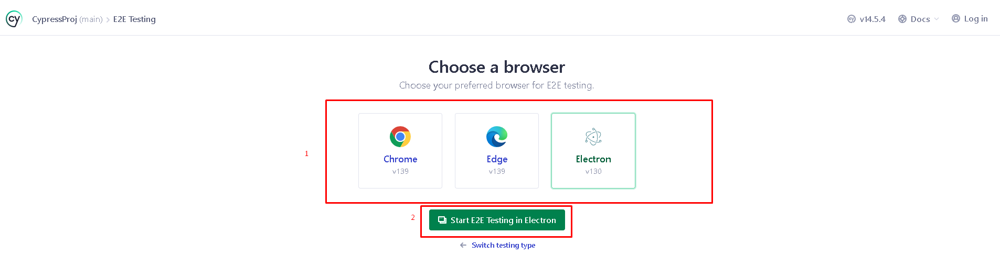
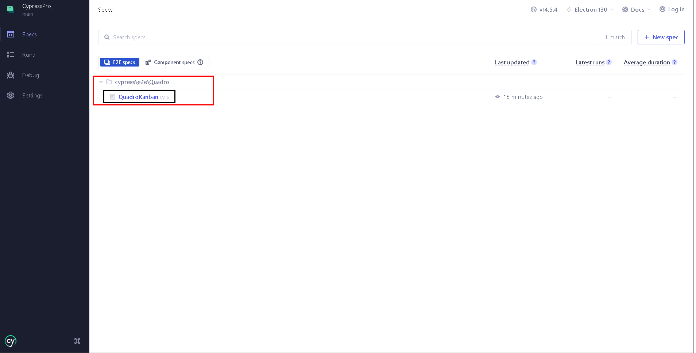
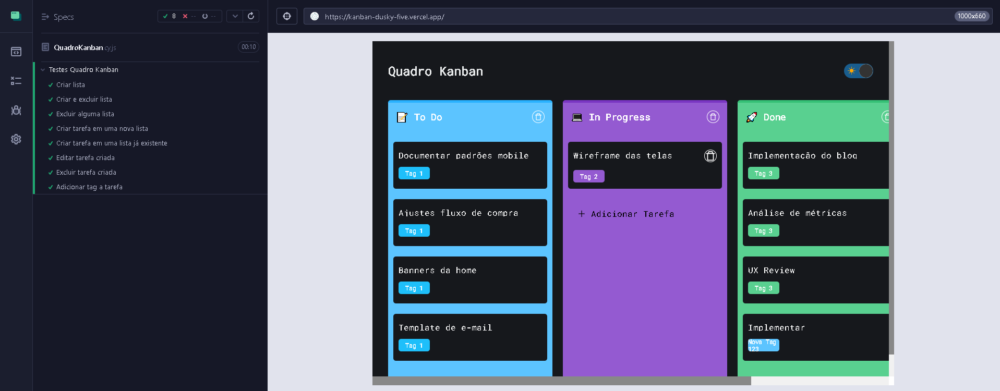
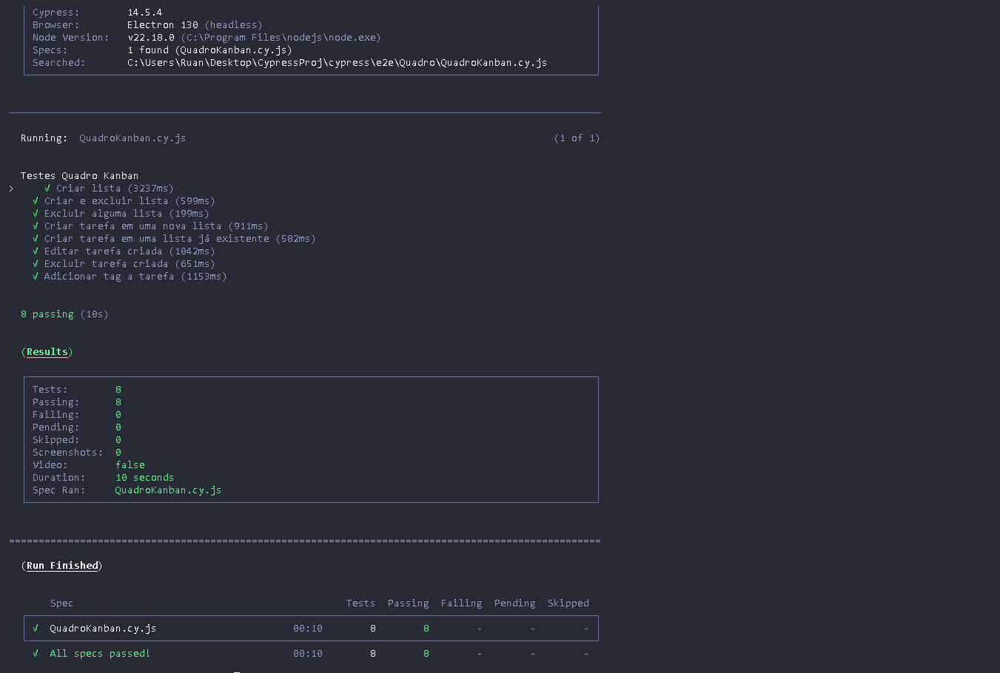

# Kanban-Dusky---Kukac

Este repositório contém testes automatizados end-to-end para o aplicativo Kanban disponível em  
https://kanban-dusky-five.vercel.app/, utilizando o framework **Cypress**.

> ⚠️ Observação: o diretório `node_modules/` não está versionado — isso é esperado. Quem clonar deve rodar `npm install` ou `yarn install` para instalar as dependências listadas em `package.json`.

---

## Sumário

- [Funcionalidades Testadas](#funcionalidades-testadas)  
- [Estrutura do Projeto](#estrutura-do-projeto)  
- [Pré-requisitos](#pré-requisitos)  
- [Instalação](#instalação)  
- [Rodar o Projeto](#rodar-o-projeto)  
  - [1. GUI (Cypress Open) — modo visual](#1-gui-cypress-open---modo-visual)  
  - [2. Run Mode (Headless) — modo sem interface](#2-run-mode-headless---modo-sem-interface)  
- [Comandos Úteis](#comandos-úteis)  
- [Dicas e Boas Práticas de Testes](#dicas-e-boas-práticas-de-testes)  
- [Contribuindo](#contribuindo)  
- [Licença](#licença)

---

## Funcionalidades Testadas

Os testes automatizados cobrem as seguintes funcionalidades no Quadro Kanban (na ordem implementada nos testes):

1. **Criar lista**
   - Verifica se é possível criar uma nova lista e se o header aparece visível.

2. **Criar e excluir lista**
   - Cria uma lista aleatória e a exclui, confirmando que não permanece no quadro.

3. **Excluir alguma lista existente**
   - Remove listas pré-existentes (ex.: "To Do", "In Progress", "Done").

4. **Criar tarefa em uma nova lista**
   - Cria uma lista e adiciona uma tarefa nela; valida presença da tarefa.

5. **Criar tarefa em uma lista já existente**
   - Adiciona uma tarefa em listas existentes; valida presença.

6. **Editar tarefa criada**
   - Edita o conteúdo da tarefa e valida a alteração.

7. **Excluir tarefa criada**
   - Remove uma tarefa e confirma que não existe mais.

8. **Adicionar tag a tarefa**
   - Adiciona uma tag a uma tarefa e valida que a tag aparece no board.

> Por que listar as funcionalidades: ajuda colaboradores e avaliadores a entenderem rapidamente o escopo dos testes e onde contribuir.

---

## Estrutura do Projeto

- `cypress/`
  - `e2e/` ou `integration/` — scripts de teste (ex.: `cypress/e2e/Quadro/QuadroKanban.cy.js`)
  - `fixtures/` — dados de teste (`datas.json`)
  - `support/` — comandos customizados (`commands.js`)
  - `assets/img/` — imagens usadas no README
- `cypress.config.js` — configurações do Cypress
- `.gitignore`
- `package.json` / `package-lock.json`
- `README.md`

---

## Pré-requisitos

- Node.js (v14+ recomendado)
- npm ou yarn
- Recomendo ter o Chrome instalado para testes mais realistas (Electron é mais leve).

---

## Instalação

1. Clone o repositório:
```bash
git clone https://github.com/RuanVSouza/Kanban-Dusky---Kukac.git
cd Kanban-Dusky---Kukac
```

2. Instale as dependências:

```bash
npm install
# ou
yarn install
```

# Rodar o Projeto


### 1. GUI (Guide User Interface)


1.1 - Copiar o comando e colar no terminal do projeto
```bash
npx cypress open
```
1.2 - Aguardar abrir a interface Até aparecer a tela para selecionar "E2E Testing"



1.3 - Selecionar algum navegador para rodar o projeto (Recomendo o Electron por ser mais leve, porem para simular testes mais reais o ideal é o chrome)



1.4 - Ao abrir a segunda interface com os arquivos, abrir a pasta e o arquivo cypress/e2e/Quadro > QuadroKanban.cy.js



1.5 - Aguardar o projeto rodar todos os testes



## 2. Run Mode (Headless)

2.1 - Escolha algum dos modos para rodar o projeto

   
Rodar todos os projetos (apenas 1 projeto)
```bash
npx cypress run
```

Rodar todos os projetos (apenas 1 projeto)
```bash
npx cypress run
```

Rodar o projeto no google (Execução 10seg)
```bash
npx cypress run --browser chrome
```

Rodar o projeto no Microsfot Edge (Execução 11seg)
```bash
npx cypress run --browser edge
```

Rodar o projeto no Electron (Recomendado: Tempo medio - 9seg)
```bash
npx cypress run --browser electron
```

Rodar especificamente o arquivo
```bash
npx cypress run --spec "cypress/e2e/Quadro/QuadroKanban.cy.js"
```

### Resultado esperado no modo Headless




